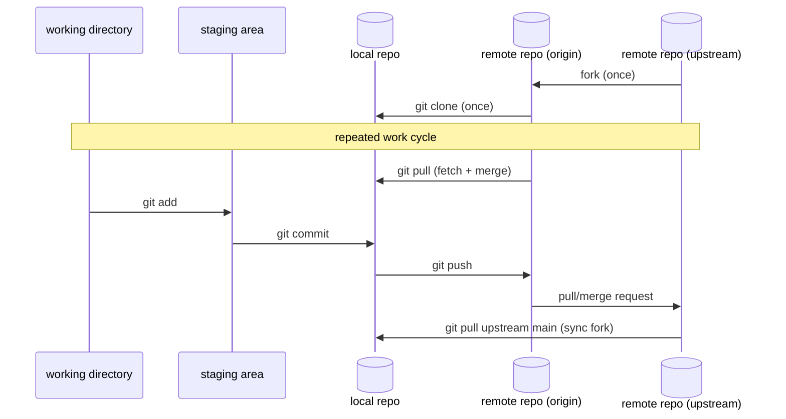

```mermaid
sequenceDiagram
  participant working as working directory
  participant staging as staging area
  participant local@{ "type" : "database" } as local repo
  participant remote@{ "type" : "database" } as remote repo (origin)
  participant upstream@{ "type" : "database" } as remote repo (upstream)
  upstream ->> remote: fork (once)
  remote ->> local: git clone (once)
  Note over working,upstream: repeated work cycle
  remote ->> local: git pull (fetch + merge)
  working ->> staging: git add
  staging ->> local: git commit
  local ->> remote: git push
  remote ->> upstream: pull/merge request
  upstream ->> local: git pull upstream main (sync fork)
```
