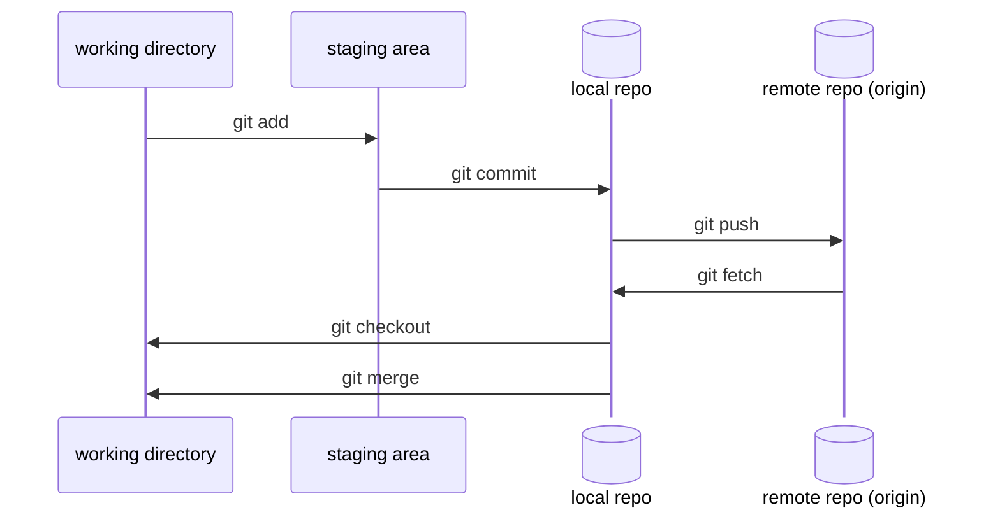

```mermaid
sequenceDiagram
  participant working as working directory
  participant staging as staging area
  participant local@{ "type" : "database" } as local repo
  participant remote@{ "type" : "database" } as remote repo (origin)
  working ->> staging: git add
  staging ->> local: git commit
  local ->> remote: git push
  remote ->> local: git fetch
  local ->> working: git checkout
  local ->> working: git merge
```
